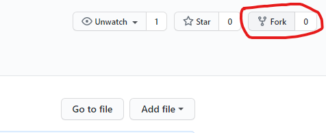
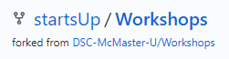
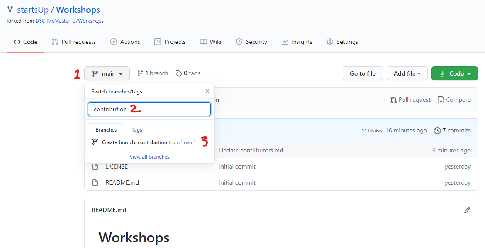
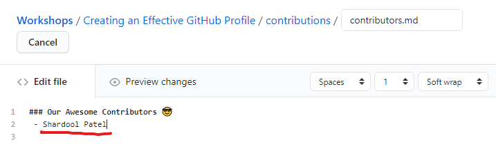
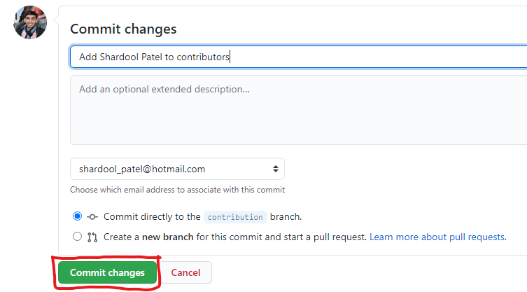
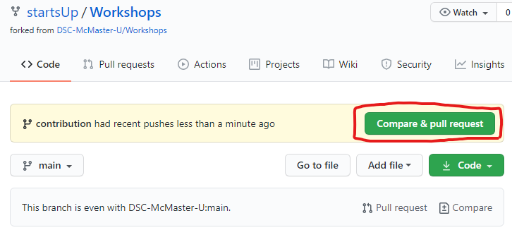

# Contributing
Contributing to open source can be hard, especially if you haven't done it before.You can watch a tutorial or read a guide, but we believe the fastest way to learn is by actually doing it. 


In this guide, we show how you can make your first contribution using this repository. These steps are usually the standard way to contribute to any open source project.   

## Make your first contribution


### 1. Fork this repository 
Create a personal copy of this repository by clicking on the **fork** button on top-right of this page.
<br/>

<br/>
<br/>
This should create a forked repository in your GitHub account.
<br/>
<br/>


### 2. Create a new branch
Create a new branch called `contribution` in your forked repository. 
<!--  -->


### 3. Make necessary changes and commit those changes
- Navigate to `contribution.md`, located under the folder - `Creating an Effective GitHub Profile > contributions > contributors.md`. Click on edit file icon ✏️, and add your name on a new line.
    ```
     - Your Name
    ``` 
    
<br/>

- Once you have edited the file, commit those changes by adding a commit message and clicking on the `Commit changes` button.

    


### 3. Submit your changes for review by creating a pull request
- Navigate back to the homepage of the forked repository (by clicking on the repository name on the top). You should now see the prompt for `Compare & pull request`
      
    

- Create pull request.

    
    
 
### That's it!
Congratulations! You just completed the standard fork -> edit -> pull request workflow that you'll encounter often as a contributor!

Once we review your changes, we will merge your pull request to this repository and you will appear as one of the contributors to this repository! 

