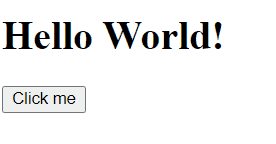

# Intro to Web Development
Welcome to our **Intro to Web Development Guide**. This workshop walks you through:
- The basics of web HTML/CSS/JavaScript
- How to create your personal website
- Hosting your website using GitHub pages

Find the workshop slides and recording here:
- Slides: https://docs.google.com/presentation/d/1T02_TB-9yCOqG8hc3grlcmElUrxhr5yt14uyBUhKyuQ/edit?usp=sharing
- Recording: https://www.youtube.com/watch?v=A3uYb8GfrHs

Find the code for this workshop under the [**code**](./code/index.html) folder.

## HTML Basics
**What is HTML?**<br>
HTML stands for **Hyper Text Markup Language**. It is not a programming language. Instead HTML is the code that defines the structure of the webpage and its content. 
The basic building block of HTML is called an **element** (think of them as lego bricks). These elements labels the type of content we are displaying, eg. if the content is a paragraph, heading, link, image etc.                    

Let's look at what these elements look like.

### Anatomy of an HTML Element 

```html
                 Content
           |------------------|
                              
    <p>     My first paragraph.    </p>

  |-----|                         |-----|
Opening tag                     Closing Tag

|------------------------------------------|
              Paragraph Element
```
- **Opening Tag** - Every element start with an `opening tag`, which contains the keyword (`p` is used for paragraph elements) enclosed in angled brackets `<>`. 
- **Content** - If the element has any content, it comes after the `opening tag` and this is what gets displayed on the webpage. 
- **Closing Tag** - To denote where the content finishes, we must end our element with the `closing tag` which follows the same syntax as the opening tag, except it contains a `/` *forward slash* before the element name.
- **Element** - Opening tag, content and the closing tag together make the element. 

Not all html elements follow this syntax exactly. Let's look at two different types of elements we can have.

#### **Nested Elements**
You can put elements inside other elements like so:  
```html
<p> I am a <strong> nested </strong> element. </p>
```
This is called **nesting**. Here out text would appear normally, with the word **nested** being bolded.

#### **Empty Elements**
Some elements are **empty** and don't have any content associated. These elements **do not** require a closing tag.
```html
 <!-- Displays an image -->
<br> <!-- Line Break -->
<hr> <!-- Horizontal Line -->
```
<sub>Note: `<!--  -->` defines a comment in HTML </sub>


#### **HTML Attributes**
You might have noticed the image element above `` has the extra code `src="cat.fig"` along with the tag name `img`. The `src` keyboard here is an example of an HTML **attribute**. 

An HTML attribute provides additional info and may change the behaviour of the HTML element. The attribute should be placed in the opening tag and follow the syntax `name="value"`. 

Examples
```html
<!-- 'class' is a global attribute -->
<p class="notes">Elements can have attributes</p>

<!-- 'src' and 'alt' are img attributes -->


<!-- 'href' is an anchor attribute -->
<a href="https://google.ca">Google</a>
```
<sub>**Global Attributes -** These are attributes that can be used with any HTML element.</sub>

- `class` - this attribute is mostly used for naming/grouping elements to apply styles (see [selective styling](#how-to-selectively-style-elements))
- `src` - Gives the image path (url)
- `alt` - The text to show when image can't be loaded onto the webpage
- `href` - The link that the anchor should navigate to (see [allowed values of href](#anchor-tag))


These are just some examples of attributes, there are a lot more specific to each HTML element but you rarely will use them. 
### Common HTML Tags

#### Anchor Tag

### HTML File structure

### Resources

## CSS Basics
What is CSS?
### CSS Box Model

### CSS Syntax

#### How to selectively style elements?

### Where to put CSS code?

### Simplifying CSS using frameworks

### Resources

## JavaScript Basics
What is JavaScript?\
Javascript is a lightweight, cross platform language mainly known for its uses in web development. It's popularly used in frameworks like `React` for Front-end Web Development and in `Node.js` for running server side code. 

### JavaScript in Web Development
JavaScript lets us bring websites to life. It lets us write code that makes our websites interactive!

Here is a simple example of interactivity enabled via JavaScript lets. When user clicks the button `Click me`, the title changes to `Hello Everyone`.



<br>

```html
...
<h1 id="greeting">Hello World!</h1>
<button id="update">Click me</button>
<!-- Script tag to embed JavaScript within HTML -->
<script>
  // get button reference
  const button = document.getElementById('update'); 

  // attach a click listener that calls updateHeader function on click.
  button.addEventListener('click', updateHeader); 
  
  // this is called when button is clicked
  function updateHeader(){
      var myHeading = document.getElementById('greeting');
      myHeading.innerHTML = 'Hello everyone!';
  }
</script>
...
```


### The Document Object Model (DOM)
What is Document Object Model (DOM)?\
Document object model is an interface that JavaScript uses to access and edit different HTML Elements. DOM repesents the HTML document as nodes and object, making it easy for programming languages like JavaScript to change the content and structure of a page.

The model is represented as a tree to accurately model the hierarchy of nested HTML Elements:\
[](https://www.w3schools.com/js/js_htmldom.asp)


In our previous [example](#javascript-in-web-development), the DOM is used to access and change the HTML elements. The majority of the DOM API is accesible via the global variable `document`.

- Accessing HTLM Element through DOM 

  ```js
  const button = document.getElementById('update'); 
  ```
- Editing HTLM Element through DOM
  
  ```js
  var myHeading = document.getElementById('greeting');
  myHeading.innerHTML = 'Hello everyone!';
  ```


### JavaScript Syntax
A few key syntax for JavaScript use:\
To try these out, you can use an online editor like [repl.it](https://repl.it/languages/javascript).

Variables:
```js
var myVariable2 = 123; // global scope
let myVariable = "hello"; // block scope (preffered over var)
const myVariable3 = [1, 2]; // similar to let, but constant value
```

Functions:
```javascript
//Function declaration
function myFunction(a, b) {
  return a * b;
}

//Function call
let a = myFunction(1,2);
console.log(a); // prints 2
```

Loops:
```javascript
let nums = [1, 2, 3];
// Lets print every number in nums array

// Using standard for loop
for (let i = 0; i < num.length; i++) {
  console.log(nums[i]);
}

/* 
Using forEach (note: forEach is an in-built function of all arrays)
Here we pass an arrow function to 'forEach', that is called for each element in the array.
*/
nums.forEach(num => console.log(num))


// Using while loop
let j = 0; // we use var here since let only has block scope
while (j < nums.length) {
  console.log(nums[j]);
  j++;
}
```

Objects:
```javascript
//Object declaration and assignment
let car = {type:"Fiat", model:"500", color:"white"};

//Accessing object data
let a = car.model; // a has the value "500"
console.log(a) // prints "500"
```

[Useful Resource for more examples and further documentation](https://www.w3schools.com/js/default.asp)


## Creating a Personal Website

## Deploying it to GitHub
